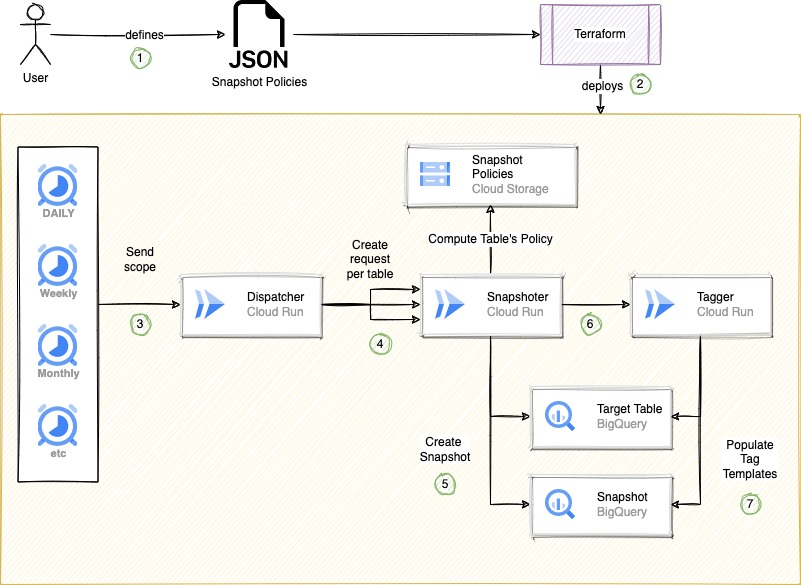

# BigQuery Snapshot Manager

## Overview

BigQuery Snapshot Manager is an OSS solution that enables you to define
a flexible and centralized backup strategy to all of your BigQuery projects, datasets and tables
while automating the frequent snapshot operations at scale

